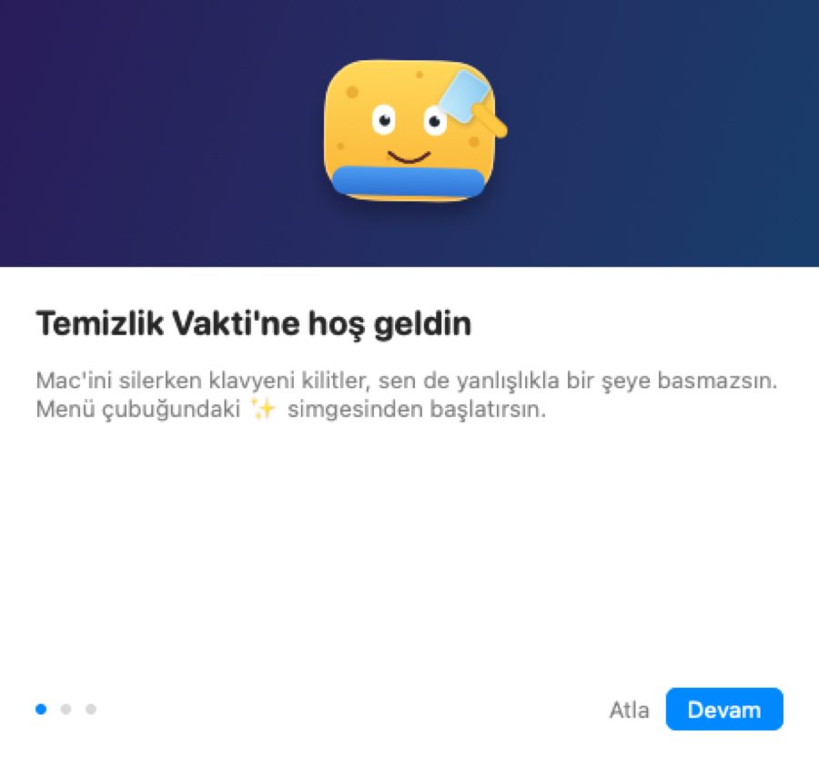

# Temizlik Vakti ✨

Mac'ini silerken **klavye ve trackpad'i kilitleyen** menü çubuğu uygulaması —
ekranı, klavyeyi, kapağı rahatça temizle, hiçbir tuş bir yere gitmesin.
Üstüne düzenli **göz molası** hatırlatıcısı, animasyonlu bir maskot ve laf sokan
yorumlar.

[](https://github.com/ns-koroglu/temizlik-vakti/releases)
[](LICENSE)
macOS 14+ · Apple Silicon ve Intel · SwiftUI

| Kilit ekranı | Göz molası | Karşılama |
|---|---|---|
|  |  |  |

---

## Ne yapar

**Temizlik kilidi.** Tüm ekranlar kaplanır ve klavye, trackpad, fare girdisi sistem
genelinde yutulur. Kilidi `esc` tuşunu basılı tutarak ya da süre dolduğunda açarsın.

**Göz molası (20-20-20).** Her 20 dakikada bir 20 saniyelik mola ekranı. Mola
**habersiz başlamaz**: 15 saniye önce sağ üstte küçük bir uyarı belirir, oradan
"şimdi başla" ya da "5 dk sonra" diyebilirsin. Bilgisayarın başında değilsen mola
atlanır. Katı modda molada giriş de kilitlenir.

**Maskot seni takip eder.** Kilitliyken imleç donuktur ama uygulama trackpad
hareketlerini zaten yakaladığı için maskot gözleriyle seni izler. Yanlışlıkla bir
tuşa basarsan irkilir ve laf sokar.

**İstatistikler.** Kaç temizlik yaptın, toplam ne kadar sürdü, kaç girdi engellendi,
kaç kusursuz tur, kaç mola. Tamamen yerel, hiçbir yere gönderilmez.

**On dil.** Sistem diline göre kendini ayarlar.

---

## Kurulum

### Hazır paket

[Releases](https://github.com/ns-koroglu/temizlik-vakti/releases) sayfasından `.zip`'i
indir, `Temizlik Vakti.app`'i `/Applications`'a taşı, **sağ tık → Aç** de.

Paket Apple Developer kimliğiyle notarize edilmediği için macOS ilk açılışta uyarı
gösterir. Sağ tık → Aç ile geçilir; alternatif olarak:

```bash
xattr -dr com.apple.quarantine "/Applications/Temizlik Vakti.app"
```

### Kaynaktan

```bash
./build.sh --install --run
```

Derler, `.app` paketini üretir, imzalar, `/Applications`'a kopyalar ve çalıştırır.
Xcode projesi yok, Swift Package Manager ile derleniyor.

> **Xcode gerekiyor** (yalnızca Command Line Tools yetmiyor). macOS 26'dan itibaren
> SwiftUI'ın `@State` gibi sarmalayıcıları makro ve makro eklentisi yalnızca Xcode
> araç zincirinde bulunuyor. Etkin araç zincirin yanlışsa `build.sh` derlemeden önce
> durup söyler: `sudo xcode-select -s /Applications/Xcode.app/Contents/Developer`

---

## İzin: Erişilebilirlik

Girişi kilitlemek için macOS'un **Erişilebilirlik** izni şart. İlk çalıştırmada açılan
karşılama ekranı bunu adım adım verdirir. Elle vermek istersen: Sistem Ayarları →
Gizlilik ve Güvenlik → Erişilebilirlik → *Temizlik Vakti*.

### İzni bir kez ver, kalıcı olsun

macOS bu izni uygulamanın **kod imzasına** bağlar. Ad-hoc imzada (`codesign -s -`) bağ
imzanın özetidir (cdhash) ve her yeniden derlemede değişir: Sistem Ayarları'ndaki
anahtar **açık görünmeye devam eder ama izin geçersizdir**. Klasik belirti: "izni
verdim, uyarı hâlâ duruyor."

Kaynaktan derliyorsan bir kez sabit, yerel bir imza kimliği oluştur:

```bash
./Scripts/setup-signing.sh
```

Giriş anahtarlığına kendinden imzalı bir kod imzalama sertifikası ekler ve `build.sh`
bundan sonra onunla imzalar. Gereksinim sertifikaya bağlandığı için
(`identifier "app.temizlikvakti.mac" and certificate root = H"…"`) izin, yeniden
derlemelerden etkilenmez. Eski geçersiz kayıtları temizlemek için:

```bash
tccutil reset Accessibility app.temizlikvakti.mac
```

Uygulama izni gerçek bir event tap denemesiyle sınar, izin verildiği anda uyarı kartı
kendiliğinden kaybolur ve kartta bir **Yeniden Başlat** düğmesi vardır.

---

## Kullanım

| İşlem | Nasıl |
|---|---|
| Temizliği başlat | Menü çubuğu → **Temizliğe Başla** |
| Kısayolla başlat | `⌃ ⌥ ⌘ C` |
| Kilidi aç | `esc` tuşunu ~2 sn basılı tut |
| Otomatik açılma | Seçilen süre dolunca (30 sn … 10 dk veya süresiz) |
| Kilitlemeden dene | Menü çubuğu → **Önizle** |
| Mola ayarları | Menü çubuğu → **Mola** sekmesi |
| İstatistikler | Ayarlar → **İstatistikler** |
| Dil | Menü çubuğu → 🌐 ya da Ayarlar → Genel → Dil |
| Karşılamayı tekrar aç | Ayarlar → Genel |

Menü çubuğu simgesi durumu gösterir: kilit/mola sürüyor, mola yaklaşıyor, hatırlatıcı
duraklatılmış.

### Temalar

**Koyu** (ekran tozunu en iyi gösterir) · **Açık** (parmak izi ve leke için) ·
**Renkli** (gradyan)

### Gizli numaralar 🥚

Kilit ekranındayken:

- **Klasik hile kodu** (↑↑↓↓←→←→BA) → parti modu: gökkuşağı fon, parıltı patlaması
- **"temiz" yaz** → sünger seni sever
- **Hızlı hızlı bir şeylere bas** → maskot sinirlenir
- **Trackpad'de sağa sola savur** → başı döner
- **45 saniye hiçbir şeye dokunma** → uyuklar
- **Caps Lock** → "Bağırmana gerek yok"
- **Hiç dokunmadan bitir** → "Kusursuz tur" rozeti

---

## Diller

🇹🇷 Türkçe (varsayılan) · 🇬🇧 English · 🇩🇪 Deutsch · 🇪🇸 Español · 🇫🇷 Français ·
🇮🇹 Italiano · 🇵🇹 Português · 🇷🇺 Русский · 🇨🇳 简体中文 · 🇯🇵 日本語

Açılışta **sistem diline** göre ayarlanır; sistem dili bu onun dışındaysa **Türkçe**
kullanılır. Elle de seçilebilir, seçim kaydedilir ve anında uygulanır.

Çeviriler `Sources/TemizlikVakti/Localization/` altında, dil başına tek dosya. Metinler
tek bir `struct` üzerinden tutulduğu için **eksik çeviri mümkün değil**: yeni bir metin
eklendiğinde çeviri dosyaları derlenmez. Yeni dil eklemek için `AppLanguage`'a bir durum
ve karşılık gelen dosyayı eklemek yeterli.

---

## Güvenlik ve gizlilik

Kilit süreç ömrüyle sınırlıdır:

- **Uygulama kapanır ya da çökerse kilit anında açılır** — macOS event tap'i düşürür.
- Arayüz donsa bile event tap kendi iş parçacığında `esc` basımını izler ve kilidi
  kendi kendine açar (acil çıkış).
- Güç düğmesi, Touch ID ve zorla kapatma macOS tarafından korunur; bunlar kilitlenemez
  ve her zaman çalışır.
- Bir yerde şifre alanı açıksa (secure input) macOS event tap'leri engelleyebilir.

Ayrıca:

- Uygulama hiçbir veriyi okumaz, yazmaz veya ağa göndermez — kaynakta tek bir ağ
  çağrısı yok.
- Paket **hardened runtime** ile imzalanır: klavye olaylarını gören bir sürece kütüphane
  enjekte edilmesi ve hata ayıklayıcı iliştirilmesi engellenir.
- Kilit sırasında yakalanan tuş kodları yalnızca gizli numaraları tanımak için bellekte
  tutulur, oturum bitince silinir; hiçbir yere yazılmaz.
- İstatistikler yalnızca yerel `UserDefaults` içinde durur.

---

## Dağıtım: notarization

Yerel kendinden imzalı paketi indiren kişi Gatekeeper uyarısı görür. Uyarısız açılan bir
paket üretmek için Apple onayı gerekir:

```bash
./build.sh --notarize
```

Developer ID Application sertifikasıyla yeniden imzalar (hardened runtime + güvenli
zaman damgası) → Apple'a gönderip sonucu bekler → onayı pakete iliştirir
(`stapler staple`) → `spctl` ile doğrular → dağıtıma hazır `.zip` üretir.

Ön koşullar:

1. Apple Developer Program üyeliği ve anahtarlıkta bir *Developer ID Application*
   sertifikası (Xcode → Settings → Accounts → Manage Certificates).
2. notarytool kimlik bilgisi — bir kez saklaman yeterli:

```bash
xcrun notarytool store-credentials "app.temizlikvakti.mac" --apple-id "posta@example.com" --team-id "ABCDE12345" --password "uygulamaya-özel-parola"
```

Parola, Apple kimliğinin normal parolası değil; [appleid.apple.com](https://appleid.apple.com)
üzerinden üretilen **uygulamaya özel paroladır**. Alternatif olarak `APPLE_ID`, `TEAM_ID`
ve `APP_PASSWORD` ortam değişkenleri kullanılabilir.

Sertifika ya da kimlik bilgisi yoksa betik **durur ve nedenini söyler**; sessizce imzasız
paket üretmez. Yerel kendinden imzalı kimlik notarize edilemez — o kimlik yalnızca
Erişilebilirlik izninin derlemeler arasında kalıcı olması için vardır.

---

## Kaldırma

```bash
# "Girişte başlat" açıksa önce Ayarlar → Genel'den kapat, yoksa hayalet giriş öğesi kalır
osascript -e 'quit app "Temizlik Vakti"'
rm -rf "/Applications/Temizlik Vakti.app"
tccutil reset Accessibility app.temizlikvakti.mac   # Erişilebilirlik kaydı
defaults delete app.temizlikvakti.mac               # ayarlar ve istatistikler
security delete-identity -c "Yerel Kod Imzasi"      # yerel imza kimliğini de silmek istersen
```

---

## Proje yapısı

```
Package.swift                    SwiftPM tanımı (SwiftUI + AppKit, macOS 14+)
build.sh                         Derleme, paketleme, imzalama, kurulum, notarization
Scripts/setup-signing.sh         Sabit yerel imza kimliği (izin kalıcılığı için)
Scripts/makeicon.swift           Uygulama simgesini kodla çizer (1024px → .icns)
Resources/Info.plist             LSUIElement: menü çubuğu uygulaması
Sources/TemizlikVakti/
  App/TemizlikVaktiApp.swift     MenuBarExtra + Ayarlar sahnesi, simge durumu
  App/AppDelegate.swift          Etkinlik ilkesi, genel kısayol, geliştirme bayrakları
  Core/InputLocker.swift         CGEvent tap: girdileri yutar, sahiplik jetonu, acil çıkış
  Core/LockSession.swift         Kilit oturumu, sayaç, bakış takibi, easter egg'ler
  Core/BreakSession.swift        Göz molası: ön uyarı fazı, zamanlayıcı, katı mod
  Core/ShieldController.swift    Her ekran için kalkan penceresi (shielding level)
  Core/Permissions.swift         Erişilebilirlik izni kontrolü, isteme, yeniden başlatma
  Core/Stats.swift               Yerel kullanım istatistikleri
  Core/SleepGuard.swift          Ekran uykusunu engelleyen IOKit assertion
  Core/Prefs.swift               Ayarlar (UserDefaults) + girişte başlatma
  Core/Sounds.swift              Sistem ses efektleri
  Content/Snark.swift            Rastgele metin seçici
  Localization/                  10 dil, dil başına tek dosya (TVStrings)
  Views/LockScreenView.swift     Kilit ekranı
  Views/BreakScreenView.swift    Mola ekranı
  Views/BreakWarningView.swift   Mola öncesi uyarı penceresi
  Views/OnboardingView.swift     İlk çalıştırma karşılaması
  Views/MascotView.swift         SwiftUI ile çizilen sünger maskot (bakış + ruh hâlleri)
  Views/BubbleField.swift        Canvas köpükler + sarsılma efekti
  Views/SparkleBurst.swift       Easter egg parıltı patlaması
  Views/MenuPanelView.swift      Menü çubuğu paneli (Temizlik / Mola sekmeleri)
  Views/SettingsView.swift       Ayarlar penceresi (Temizlik / Mola / Genel / İstatistik)
  Views/RenderPreview.swift      Ekranları PNG'ye çizen geliştirme yardımcısı
```

### Sürüm numarası

Sürüm elle yönetilmiyor: `build.sh` her derlemede git'ten türetiyor.

| Alan | Kaynak | Örnek |
|---|---|---|
| `CFBundleShortVersionString` | En son git etiketi (`v` atılır) | `v1.1.0` → `1.1.0` |
| `CFBundleVersion` | Toplam commit sayısı | `9` |

Yeni sürüm çıkarmak için etiket atman yeterli:

```bash
git tag v1.2.0 && git push --tags
./build.sh --install
```

Değerler pakete **imzalamadan önce** yazılır (sonrasında yazmak imzayı bozar).
Git deposu ya da etiket yoksa `Resources/Info.plist`'teki değerler korunur, derleme
durmaz. Etiketin ötesinde commit varsa ya da çalışma ağacı kirliyse derleme çıktısı
bunu `[+d]` olarak belirtir.

### Geliştirme

```bash
swift build -c release                              # yalnızca derle
./build.sh --run                                    # derle + paketle + çalıştır
./build.sh --reset-perm                             # Erişilebilirlik kaydını sıfırla
```

Ekranları **kilitlemeden** PNG olarak çizmek için:

```bash
"build/Temizlik Vakti.app/Contents/MacOS/TemizlikVakti" --render /tmp/onizleme.png lock
```

Modlar: `lock` (varsayılan), `break`, `party`, `onboard`, `warning`. Erişilebilirlik
izninin gerçekten geçerli olup olmadığını ölçmek için `--check`.

---

## In English

**Temizlik Vakti** ("Cleaning Time") is a macOS menu bar app that locks your keyboard,
trackpad and mouse so you can physically clean your Mac without triggering anything,
plus a 20-20-20 eye break reminder that warns you 15 seconds before it takes over the
screen. It draws a full-screen shield over every display, swallows all input through a
`CGEventTap`, and unlocks when you hold `esc` (or when the timer runs out). The mascot
follows your trackpad movements even while input is frozen, and there are a few easter
eggs hidden in there.

Available in 10 languages (Turkish, English, German, Spanish, French, Italian,
Portuguese, Russian, Chinese, Japanese) — it follows your system language and falls back
to Turkish. Requires Accessibility permission; the lock dies with the process, so a crash
or quit always restores input. Signed with hardened runtime; nothing leaves your Mac.

Download from [Releases](https://github.com/ns-koroglu/temizlik-vakti/releases) or build
with `./build.sh --install --run` (macOS 14+).

MIT lisanslı.
