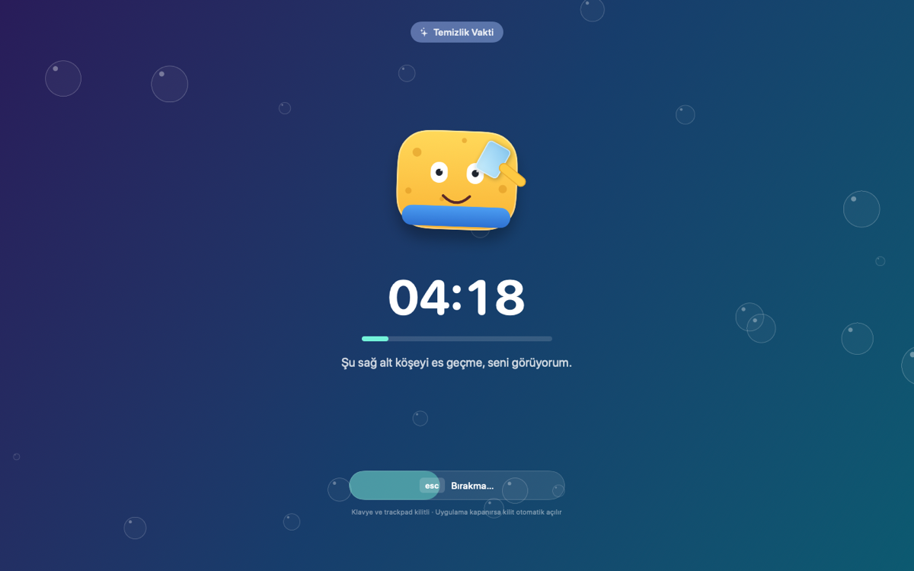
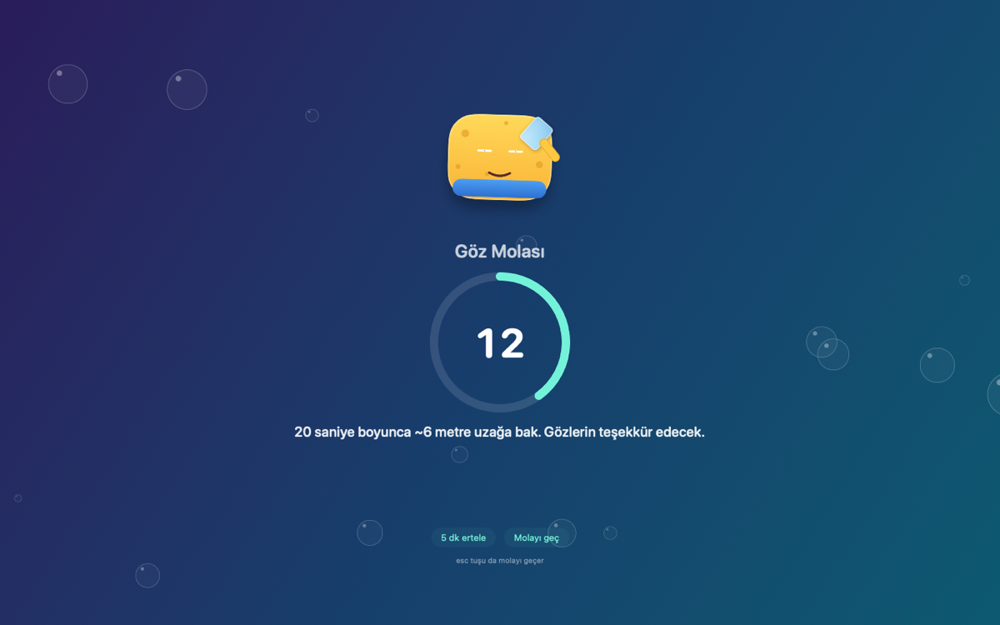
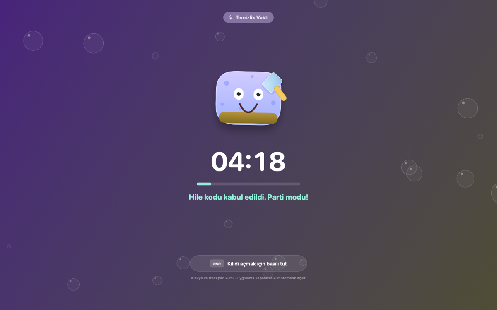

# Temizlik Vakti ✨

Mac'ini fiziksel olarak silerken (ekran, klavye, trackpad) yanlışlıkla bir yerlere
basmayasın diye **klavye ve fare/trackpad girişini kilitleyen** menü çubuğu uygulaması.
Üstüne bir de **göz molası hatırlatıcısı** var.

[CleanupBuddy](https://cleanupbuddy.app) ile aynı fikir; Türkçe arayüz, kendi maskotu,
laf sokan yorumlar ve gizli numaralarla. Apple Silicon (macOS 14+) için yazıldı.

| Kilit ekranı | Göz molası | Parti modu (gizli) |
|---|---|---|
|  |  |  |

## Ne yapar

**Temizlik kilidi** — Tüm ekranlar kaplanır, klavye/trackpad/fare girişi sistem
genelinde yutulur. Sen silerken hiçbir tuş bir yere gitmez. Kilidi `esc` tuşunu
basılı tutarak ya da süre dolunca açarsın.

**Göz molası (20-20-20)** — Her 20 dakikada bir, 20 saniyeliğine ekranı kaplayan
mola ekranı. Katı modda giriş de kilitlenir; normal modda `esc` ile geçilir veya
5 dakika ertelenir. Bilgisayarın başında değilsen mola atlanır.

**Maskot** — Kilitliyken imleç donuktur ama uygulama trackpad hareketlerini zaten
yakaladığı için maskot **gözleriyle seni takip eder**. Yanlışlıkla tuşa basarsan
irkilir ve laf sokar.

## Kurulum

```bash
./build.sh --install --run
```

Derler, `Temizlik Vakti.app` paketini üretir, `/Applications` içine kopyalar ve
çalıştırır. Sadece derlemek için `./build.sh`.

### İlk çalıştırma — Erişilebilirlik izni

Girişi kilitlemek için macOS'un **Erişilebilirlik** iznine ihtiyaç var:

1. Menü çubuğundaki ✨ simgesine tıkla → **İzin İste**
2. Sistem Ayarları → **Gizlilik ve Güvenlik → Erişilebilirlik** listesinde
   *Temizlik Vakti*'ni aç
3. Panelde **Yenile**'ye bas

### İzni bir kez ver, kalıcı olsun

macOS, Erişilebilirlik iznini uygulamanın **kod imzasına** bağlar. Ad-hoc imzada
(`codesign -s -`) bu bağ imzanın özetidir (cdhash) ve her yeniden derlemede değişir:
Sistem Ayarları'ndaki anahtar **açık görünmeye devam eder ama izin geçersizdir**.
Klasik belirti: "izni verdim, uyarı hâlâ duruyor."

Kalıcı çözüm — bir kez sabit, yerel bir imza kimliği oluştur:

```bash
./Scripts/setup-signing.sh
```

Bu, giriş anahtarlığına kendinden imzalı bir kod imzalama sertifikası ekler ve
`build.sh` bundan sonra onunla imzalar. İmza gereksinimi sertifikaya bağlandığı için
(`identifier "app.temizlikvakti.mac" and certificate root = H"…"`) izin, yeniden
derlemelerden etkilenmez.

Kurulumdan sonra bir kez temizlik:

```bash
tccutil reset Accessibility app.temizlikvakti.mac   # eski geçersiz kayıtları sil
```

sonra izni yeniden ver. Kimliği kaldırmak istersen:
`security delete-identity -c "Yerel Kod Imzasi"`

Uygulama izni artık gerçek bir event tap denemesiyle sınıyor (yalnızca
`AXIsProcessTrusted()` ile değil), izin verildiği anda uyarı kartı kendiliğinden
kayboluyor ve kartta bir **Yeniden Başlat** düğmesi var.

## Kullanım

| İşlem | Nasıl |
|---|---|
| Temizliği başlat | Menü çubuğu → **Temizliğe Başla** |
| Kısayolla başlat | `⌃ ⌥ ⌘ C` |
| Kilidi aç | `esc` tuşunu ~2 sn basılı tut |
| Otomatik açılma | Seçilen süre dolunca (30 sn … 10 dk veya süresiz) |
| Kilitlemeden dene | Menü çubuğu → **Önizle** |
| Mola ayarları | Menü çubuğu → **Mola** sekmesi |

### Gizli numaralar 🥚

Kilit ekranındayken:

- **Klasik hile kodu** (↑↑↓↓←→←→BA) → parti modu: gökkuşağı arka plan, parıltı patlaması
- **"temiz" yaz** → sünger seni sever, parıltılar saçılır
- **Hızlı hızlı bir şeylere bas** → maskot sinirlenir: "Tamam tamam! Anladım!"
- **Trackpad'de sağa sola savur** → başı döner, gözleri fırıl fırıl
- **45 saniye hiçbir şeye dokunma** → maskot uyuklar (zzz)
- **Caps Lock** → "Bağırmana gerek yok"
- **Hiç dokunmadan bitir** → "Kusursuz tur" rozeti

### Temalar

**Koyu** (ekran tozunu gösterir) · **Açık** (parmak izi/kir için) · **Renkli** (gradyan)

## Diller

🇹🇷 Türkçe (varsayılan) · 🇬🇧 English · 🇩🇪 Deutsch · 🇪🇸 Español · 🇫🇷 Français · 🇮🇹 Italiano · 🇵🇹 Português · 🇷🇺 Русский · 🇨🇳 简体中文 · 🇯🇵 日本語

Uygulama açılışta **sistem diline** göre kendini ayarlar. Sistem dili bu on dilden
biri değilse **Türkçe** kullanılır. Dili elle de seçebilirsin (menüdeki 🌐 düğmesi
ya da Ayarlar → Genel → Dil); seçim kaydedilir ve anında uygulanır.

Çeviriler `Sources/*/Localization/` altında, dil başına tek dosya. Metinler tek bir
`struct` üzerinden tutulduğu için **eksik çeviri mümkün değil**: yeni bir metin
eklendiğinde çeviri dosyaları derlenmez, tamamlanana kadar hata verir. Yeni bir dil
eklemek için `AppLanguage`'a bir durum ve karşılık gelen dosyayı eklemek yeterli.

## Güvenlik

Kilit süreç ömrüyle sınırlıdır:

- **Uygulama kapanır/çökerse kilit anında açılır** (macOS event tap'i düşürür)
- Arayüz donsa bile event tap kendi iş parçacığında `esc` basımını izler ve
  kilidi kendi kendine açar (acil çıkış)
- Güç düğmesi, Touch ID ve zorla kapatma macOS tarafından korunur — her zaman çalışır
- Bir yerde şifre alanı açıksa (secure input) macOS event tap'leri engelleyebilir

Uygulama hiçbir veriyi okumaz, yazmaz veya ağa göndermez.

## Proje yapısı

```
Package.swift                  SwiftPM tanımı (SwiftUI + AppKit, macOS 14+)
build.sh                       Derleme, .app paketleme, ad-hoc imzalama, kurulum
Resources/Info.plist           Paket bilgileri (LSUIElement: menü çubuğu uygulaması)
Scripts/makeicon.swift         Uygulama simgesini kodla çizer (1024px → .icns)
Sources/TemizlikVakti/
  App/TemizlikVaktiApp.swift   MenuBarExtra + Ayarlar sahnesi
  App/AppDelegate.swift        Etkinlik ilkesi, genel kısayol, --render bayrağı
  Core/InputLocker.swift       CGEvent tap: girdileri yutar, sinyal üretir, acil çıkış
  Core/LockSession.swift       Kilit oturumu, sayaç, bakış takibi, easter egg'ler
  Core/BreakSession.swift      20-20-20 göz molası zamanlayıcısı
  Core/ShieldController.swift  Her ekran için kalkan penceresi (shielding level)
  Core/Permissions.swift       Erişilebilirlik izni kontrolü/isteği
  Core/SleepGuard.swift        Ekran uykusunu engelleyen IOKit assertion
  Core/Prefs.swift             Ayarlar (UserDefaults) + girişte başlatma
  Core/Sounds.swift            Sistem ses efektleri
  Content/Snark.swift          Rastgele metin seçici
  Localization/                10 dil, dil başına tek dosya (TVStrings)
  Views/LockScreenView.swift   Kilit ekranı
  Views/BreakScreenView.swift  Mola ekranı
  Views/MascotView.swift       SwiftUI ile çizilen sünger maskot (bakış + ruh hâlleri)
  Views/BubbleField.swift      Canvas köpükler + sarsılma efekti
  Views/SparkleBurst.swift     Easter egg parıltı patlaması
  Views/MenuPanelView.swift    Menü çubuğu paneli (Temizlik / Mola sekmeleri)
  Views/SettingsView.swift     Ayarlar penceresi
  Views/RenderPreview.swift    Ekranları PNG'ye çizen geliştirme yardımcısı
Scripts/setup-signing.sh       Sabit yerel imza kimliği oluşturur (izin kalıcılığı için)
```

### Geliştirme

```bash
swift build -c release
./build.sh --run
"build/Temizlik Vakti.app/Contents/MacOS/TemizlikVakti" --render /tmp/onizleme.png lock
```

Son komut kilit ekranını **ekranı kilitlemeden** PNG olarak çizer.
Modlar: `lock`, `break`, `party`.

---

## In English

**Temizlik Vakti** ("Cleaning Time") is a macOS menu bar app that locks your keyboard,
trackpad and mouse so you can physically clean your Mac without triggering anything,
plus a 20-20-20 eye break reminder. It draws a full-screen shield over every display,
swallows all input through a `CGEventTap`, and unlocks when you hold `esc` (or when the
timer runs out). The mascot follows your trackpad movements even while input is frozen,
and there are a few easter eggs hidden in there. Available in 10 languages
(Turkish, English, German, Spanish, French, Italian, Portuguese, Russian, Chinese,
Japanese) — it follows your system language and falls back to Turkish. Requires Accessibility
permission; the lock dies with the process, so a crash or quit always restores input.

Build with `./build.sh --install --run` (needs Xcode or Command Line Tools, macOS 14+).

MIT lisanslı.
